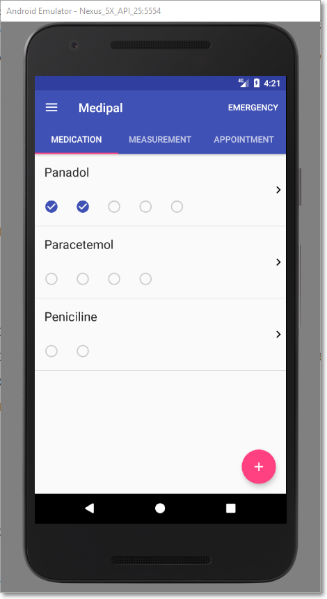
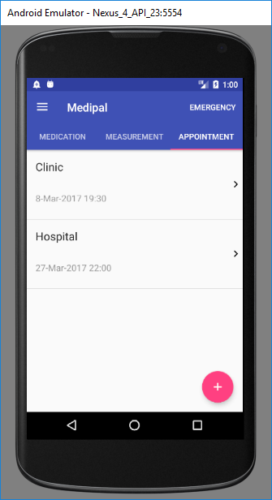

MediPal is an android application for you to keep track of your medications, medical appointments, and consumptions.

Practised using USE CASE Driven developed and TDD approach.

### Operations

1. View help screens at first time use
2. Manage personal bio
3. Manage health bio
4. Manage medications and categories
5. Manage medical appointments
6. Manage medicine consumptions
7. Manage emergency contacts
8. Manage measurements
9. View/Export reports

Meidications                   |  Consumption
:-----------------------------:|:-------------------------:
 | 

appointments                   |  Notifications
:-----------------------------:|:-------------------------:
       | 